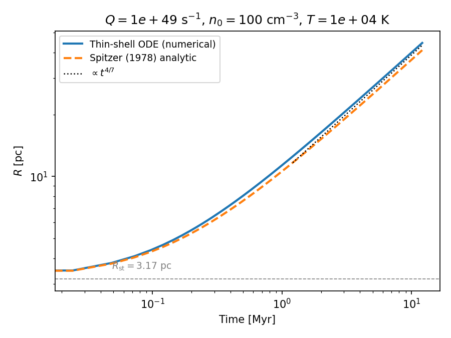
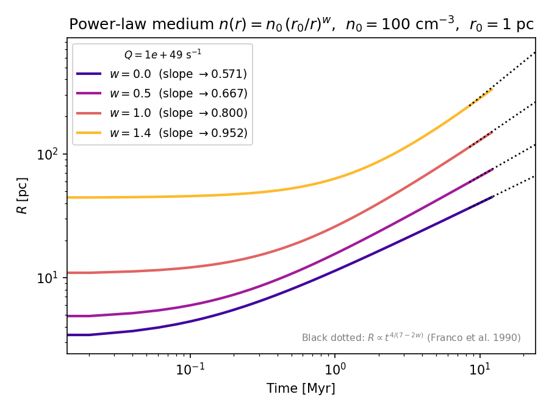
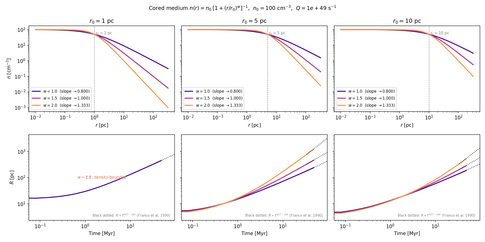

# hii-expansion

A Python package for computing HII region expansion into arbitrary radial density profiles.

Solves the thin-shell momentum equation numerically for general `n(r)`, with the [Spitzer (1978)](https://ui.adsabs.harvard.edu/abs/1978ppim.book.....S) analytic solution for uniform density as validation.

## Physics

An OB star with ionizing photon rate `Q` inflates an HII region by over-pressuring the ionized shell relative to the neutral surroundings. The shell obeys:

```
d(M_sh v)/dt = 4π R² P_in
```

where the interior pressure follows from instantaneous ionization balance:

```
n_i = sqrt(3Q / (4π α_B R³)),    P_in = 2 n_i k_B T
```

The ODE state vector `[R, v, M_sh]` is integrated forward from the initial Stromgren radius using `scipy.integrate.solve_ivp`. For constant density, the asymptotic solution is the [Spitzer (1978)](https://ui.adsabs.harvard.edu/abs/1978ppim.book.....S) power law `R ∝ t^(4/7)`; for a power-law ambient density `n ∝ r^{-w}`, the late-time slope is `R ∝ t^{4/(7-2w)}` ([Franco et al. 1990](https://ui.adsabs.harvard.edu/abs/1990ApJ...349..126F)).

## Installation

```bash
pip install -e .
```

Requires Python ≥ 3.12, numpy, scipy, astropy, matplotlib.

## Usage

```python
from hii_expansion import HIIRegion, alpha_B_case_B, spitzer_solution
from hii_expansion.constants import PC, YR

Q  = 1e49    # ionizing photon rate [s⁻¹]
n0 = 100.0   # ambient density [cm⁻³]
T  = 1e4     # temperature [K]

# Uniform density — numeric ODE
hii = HIIRegion(Q=Q, n=n0, T=T)
sol = hii.evolve((0.0, 50 * hii.stromgren_radius() / hii.c_II),
                 n_eval=500, rtol=1e-10, atol=0.0)
# sol.t  → time array [s]
# sol.y[0] → R(t) [cm]

# Spitzer analytic solution at the same times
R_sp = spitzer_solution(Q, n0, T, sol.t)

# Power-law density profile
def n_powerlaw(r, w=1.0, r0=PC):
    return n0 * (r0 / r) ** w

hii_pl = HIIRegion(Q=Q, n=n_powerlaw, T=T)
sol_pl = hii_pl.evolve((0.0, 50 * hii.stromgren_radius() / hii.c_II),
                       n_eval=500, rtol=1e-10, atol=0.0)

# Cored density profile with breakpoint hint for robust integration
def n_cored(r, w=2.0, r0=5*PC):
    return n0 / (1.0 + (r / r0) ** w)

hii_c = HIIRegion(Q=Q, n=n_cored, T=T, integration_points=[5*PC])
sol_c = hii_c.evolve((0.0, 50 * hii.stromgren_radius() / hii.c_II),
                     n_eval=500, rtol=1e-10, atol=0.0)
```

## Example results

### Constant density — numerical vs. Spitzer analytic

The thin-shell ODE matches the Spitzer (1978) analytic solution within ~7% at late times (the small offset comes from the ram-pressure term absent in the quasi-static approximation). Both converge to `R ∝ t^(4/7)`.



### Power-law density — `n(r) = n₀ (r₀/r)^w`

Late-time slopes `R ∝ t^{4/(7−2w)}` (Franco et al. 1990) are shown as black dotted reference lines. Steeper profiles (`w → 1.5`) drive faster expansion.



### Cored density — `n(r) = n₀ / [1 + (r/r₀)^w]`

Flat core at `r < r₀`, power-law decline at `r > r₀`. For small cores (`r₀ = 1` pc) with steep profiles the medium becomes **density-bounded** (total recombination rate `< Q`), so no radiation-bounded Stromgren sphere exists.



## Running the example scripts

```bash
python python/plot_constant_density.py   # → python/constant_density.png
python python/plot_powerlaw.py           # → python/powerlaw_density.png
python python/plot_cored_profile.py      # → python/cored_density.png
python python/report_cored_stromgren.py  # Stromgren radius table
```

## Tests

```bash
pytest
```

34 tests covering recombination coefficients, Stromgren radius scaling laws, Spitzer analytic solution, and ODE evolution.

## References

- Spitzer, L. (1978), *Physical Processes in the Interstellar Medium*, Wiley
- Franco, J., Tenorio-Tagle, G., & Bodenheimer, P. (1990), ApJ, 349, 126
- Draine, B. T. (2011), *Physics of the Interstellar and Intergalactic Medium*, Princeton University Press
